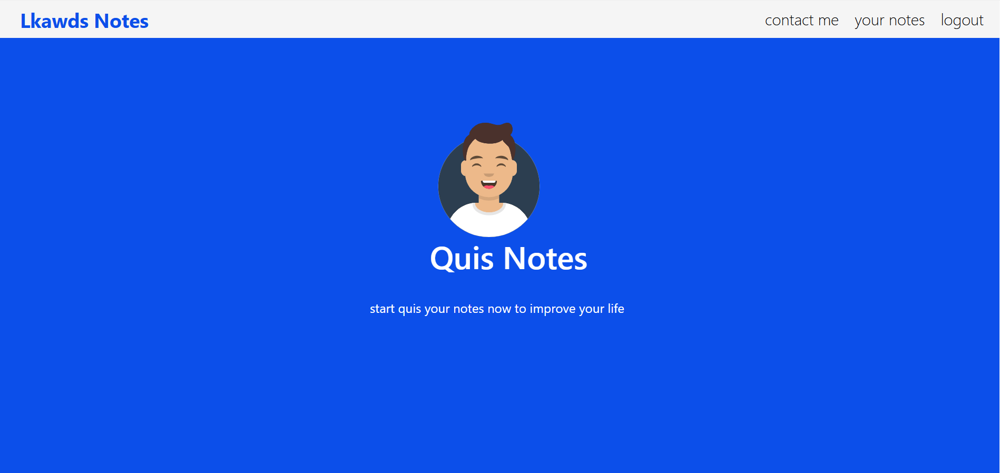

Notes App is a secure, user-authenticated web application built with Django, designed to help users create, manage, and organize personal notes efficiently.
Featuring a clean UI and CRUD functionality, the app ensures a smooth and reliable note-taking experience.

